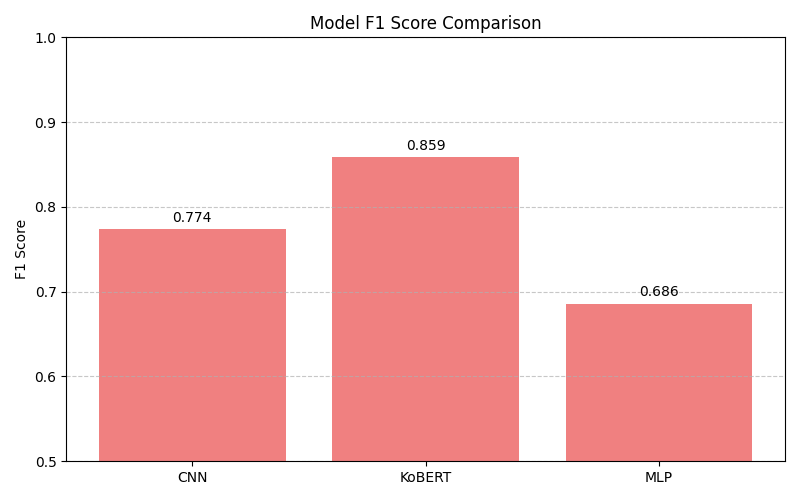

# Sentiment Classification with CNN, MLP, KoBERT

This project compares the performance of three models (CNN, MLP, KoBERT) on Korean sentiment analysis using the NSMC dataset.

## Overview

- **Dataset**: Naver Sentiment Movie Corpus (NSMC)
- **Models**: CNN, MLP, KoBERT
- **Libraries**: PyTorch, Huggingface Transformers
- **Goal**: Compare model performance under consistent preprocessing and training conditions

## Pipeline

1. **Data Loading**
   - Load NSMC in `.txt` format
   - Limit training samples to 10,000 for fairness

2. **Preprocessing**
   - Tokenization with `KoBERT` tokenizer
   - Padding and truncation to fixed length (128)

3. **Model Training**
   - Train each model (CNN, MLP, KoBERT) for 3 epochs
   - Use CrossEntropyLoss and Adam optimizer
   - KoBERT uses mixed-precision training (`fp16=True`)

4. **Evaluation**
   - Metrics: Accuracy and F1 Score
   - Results are saved in `.json` format
   - Comparison visualized using matplotlib

## Results Summary

| Model  | Accuracy | F1 Score |
|--------|----------|----------|
| CNN    | 0.7814   | 0.7739   |
| MLP    | 0.7064   | 0.6856   |
| KoBERT | 0.8553   | 0.8586   |

## Visualization

### Accuracy Comparison

### F1 Score Comparison

## Notes

- All models use the same tokenizer and data split
- Logs and results are automatically saved under `results/`
- This project is part of a portfolio targeting NLP and LLM research

